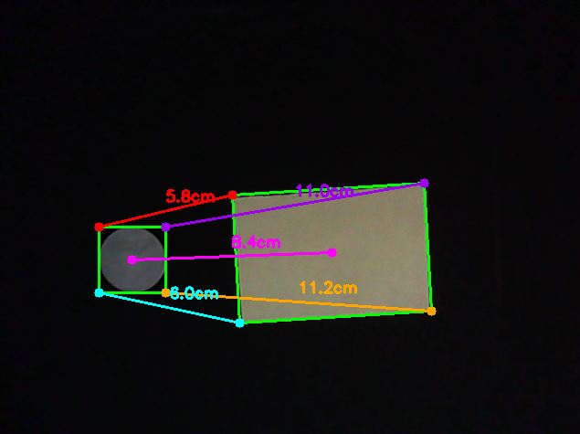
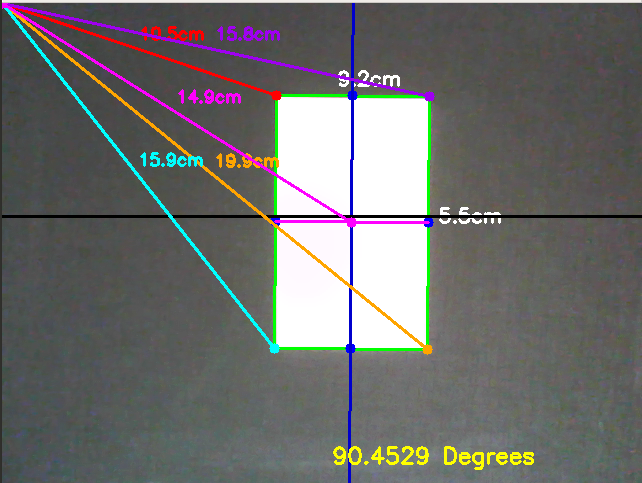
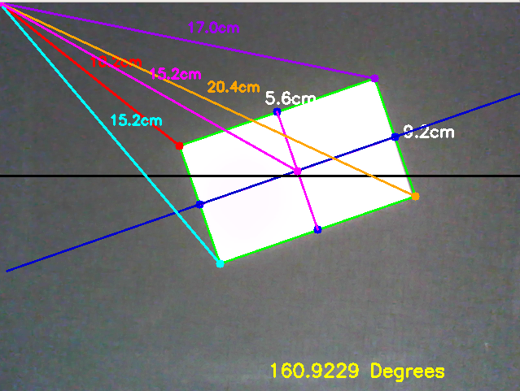

# Angle-Distance
Finding distance of various objects from a reference object and their angle with respect to x-axis 

## What this is about 
### distance from a reference object (coin)

### distance and angle from origin of frame (0,0)

You can use this to find distance between objects as well as their ange of orientation in real time
## Dependencies
First of all you will need a web cam and -
1. python
2. opencv
3. imutils
4. scipy
